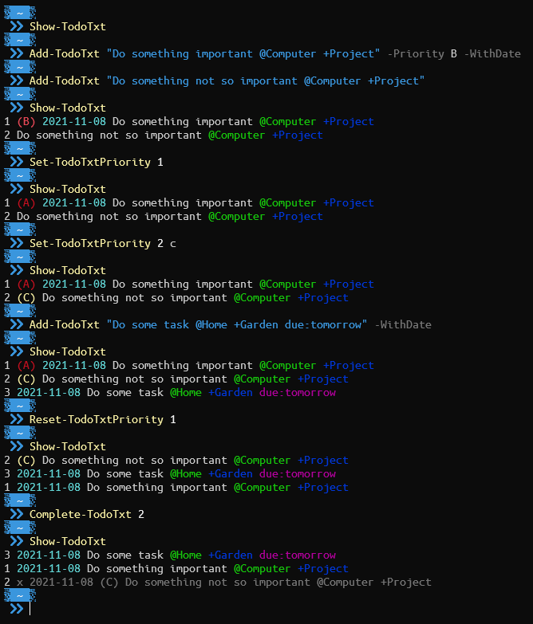
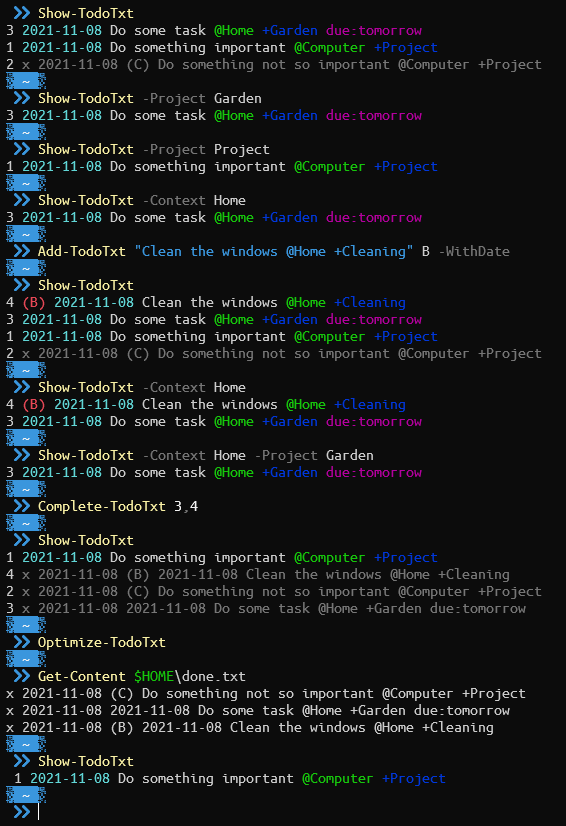

# todo.txt-ps1

PowerShell module for managing your `todo.txt` file.

This is a hobby project I started so that I can manage my `todo.txt` file using PowerShell.

The module is far from being complete but as it reached a fairly usable state I'm happy to share it with whoever may would like to use it.

Future plans include:
- simplifying user interface by creating a _facade_ function (instead of several functions)
- configuration (e.g. colours, default settings)
- more feature parity with the original [todo.txt-cli](https://github.com/todotxt/todo.txt-cli) 

For more information on `todo.txt` see their official site: http://todotxt.org/.

## How to install

To install the module simply clone/download the source code to a folder of your choice.
Then use the following command to import the module:

```powershell
Import-Module {PATH_TO_DOWNLOADED_REPOSITORY}\TodoTxt
```

This will add the following functions:

- `Add-TodoTxt`
- `Complete-TodoTxt`
- `Optimize-TodoTxt`
- `Reset-TodoTxtPriority`
- `Set-TodoTxtPriority`
- `Show-TodoTxt`

## How to use

The module -- as of now -- expects `todo.txt` and `done.txt` files to exist in the users home folder (`$HOME`).
Please create these files before starting to use the module.

### `Show-TodoTxt`

This command will get the contents of `todo.txt` and print a list using ANSI color codes for a coloured output.

By default the contents of the file will be sorted alphabetically.
To change this use the `SortBy` parameter.
Possible values for sorting are: Id, Text, Priority, Projects, Contexts

To filter the list by context or project use the corresponding `Context` or `Project` parameter.
These will issue a regex based match on the contexts/projects.

### `Add-TodoTxt`

This command will add a new Todo to `todo.txt`.
Optional parameters are `Priority` (a single character) and `WithDate` switch, which adds a creation date to the newly created Todo.

### `Complete-TodoTxt`

This command expects a Todo ID, or a list of Todo IDs and marks each of the Todo items as done, adding a completion date as well.

### `Optimize-TodoTxt`

This command will take all completed Todo items, remove them from `todo.txt` and append them to `done.txt`.

### `Set-TodoTxtPriority`

This command expects a Todo ID and optionally a character for priority.
When a priority is supplied, it will be set on the given Todo item.
If no priority is set, the current priority of the given Todo item will be _bumped_, i.e. it's priority will be increased.
If no priority is set on the given Todo item, it will be set to priority `(A)`.

### `Reset-TodoTxtPriority`

This command expects a Todo ID, or a list of Todo IDs and removes the priorities from the given Todo items.

## Examples




## Contributing

Any contribution is welcome.
Please feel free to open issues or create pull requests.
